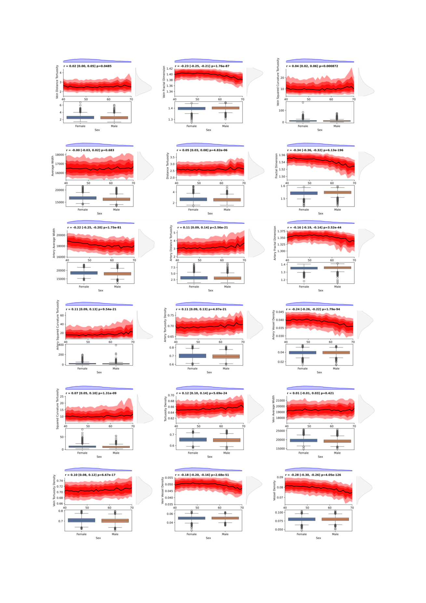
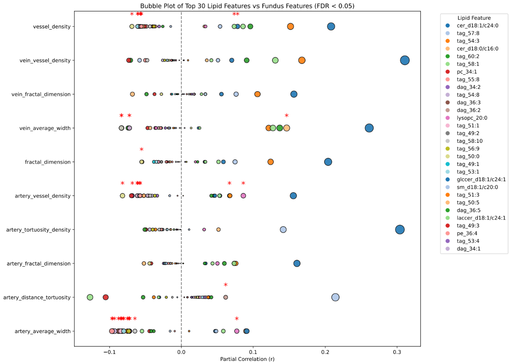
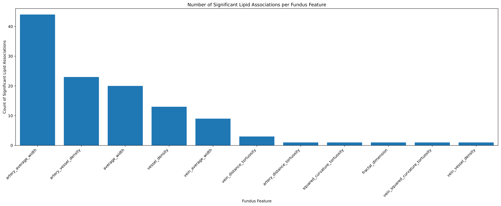
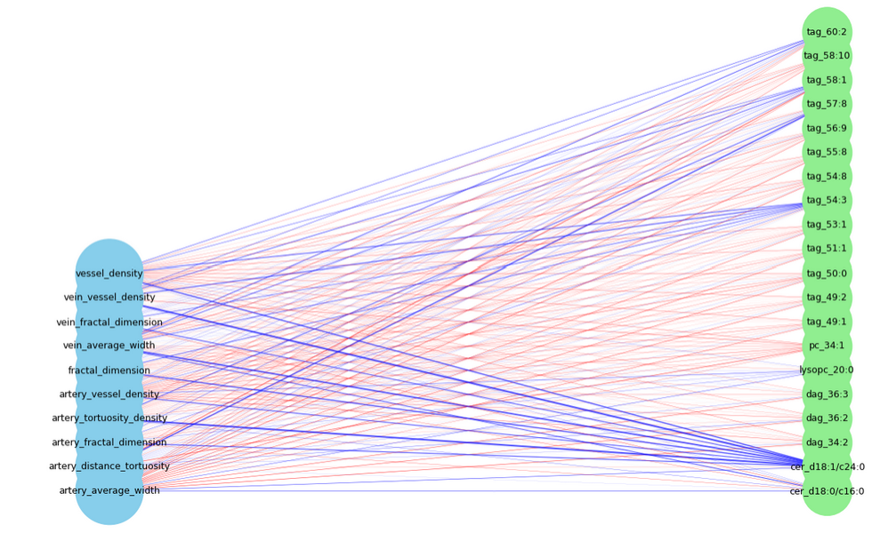
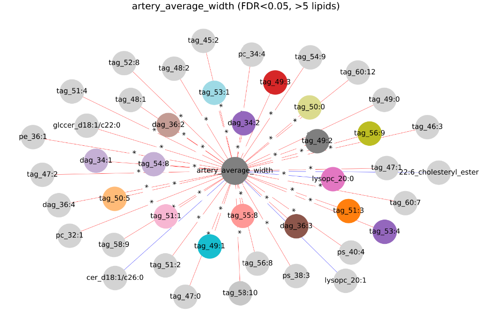
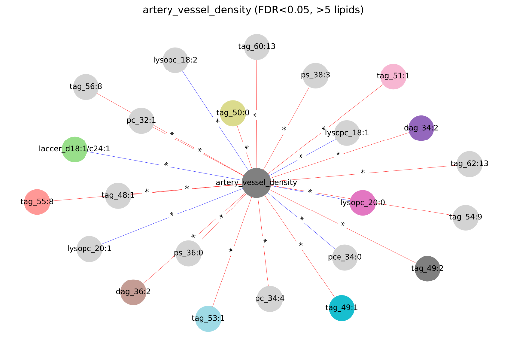
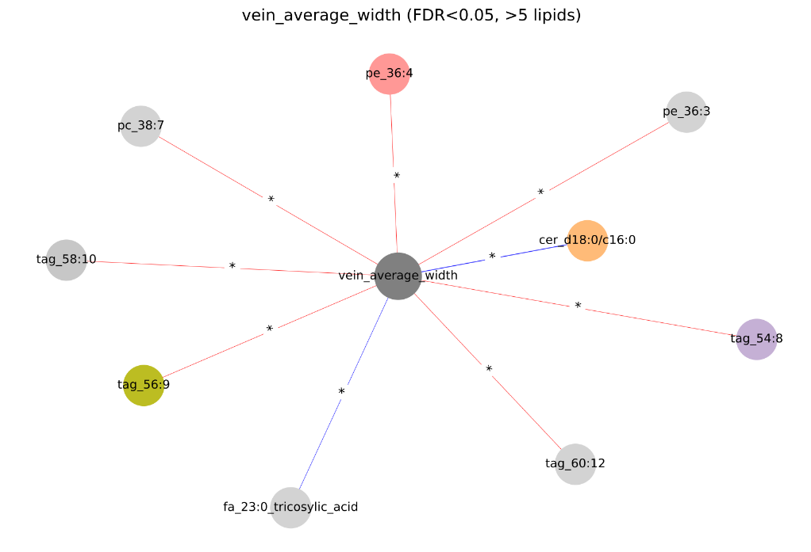
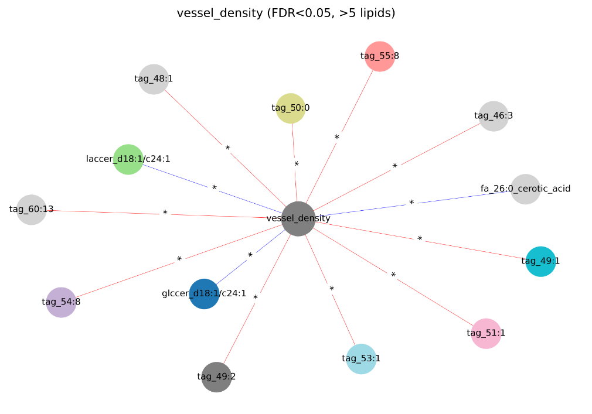
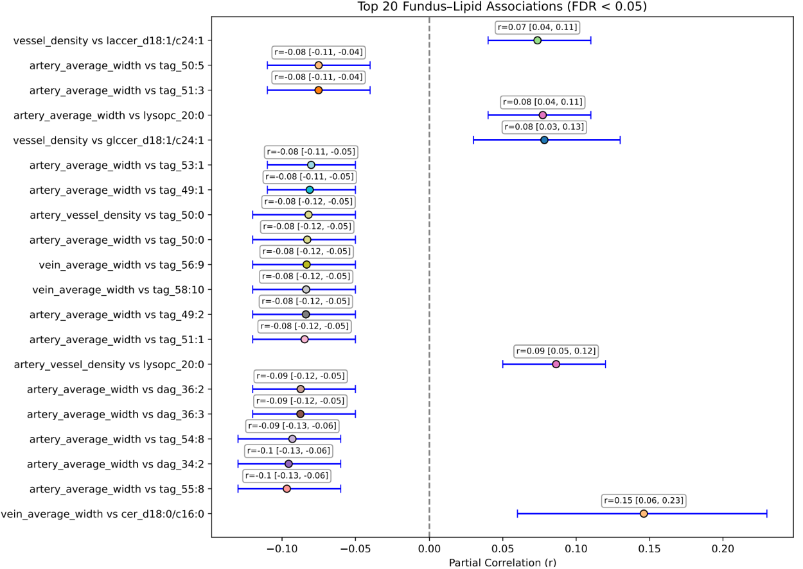

<h1 align="center">Integrated Oculomics and Lipidomics Analysis Code</h1>

<p align="center"><strong>Public analysis repository for retinal microvascular feature screening and fundus-lipidomics integration in cardiovascular health research.</strong></p>

<p align="center">
  <a href="https://github.com/Inamullah-Colab/fundus-lipidomics-oculomics">Repository</a> |
  <a href="CODE_AVAILABILITY.md">Code Availability</a> |
  <a href="REPRODUCIBILITY.md">Reproducibility</a> |
  <a href="FIGURE_MANIFEST.md">Figure Manifest</a> |
  <a href="examples/README.md">Examples</a>
</p>

---

## Study At A Glance

| Item | Summary |
|---|---|
| Study focus | Integration of retinal microvascular phenotypes and serum lipidomics |
| Data context | Secondary Human Phenotype Project data accessed through the Pheno.AI Trusted Research Environment |
| Core adjustment strategy | Partial Pearson correlations with age and sex adjustment |
| Main outputs | Feature screening results, multimodal association summaries, and manuscript figures |
| Interpretation scope | Association-focused, cross-sectional, non-causal |

> This repository contains the public code and figure assets used to support the computational workflow of the paper. It is intended to make the analytical pipeline clear, inspectable, and easier to review.

---

## Workflow

| Stage | Purpose | Main file |
|---|---|---|
| 1. Fundus preprocessing | Harmonize participant-level retinal variables and derive averaged eye-level features | [`src/01_preprocess_hpp_fundus.py`](src/01_preprocess_hpp_fundus.py) |
| 2. Covariate-adjusted retinal analysis | Screen retinal traits against age while adjusting for sex | [`src/02_age_sex_covariate_adjustment.py`](src/02_age_sex_covariate_adjustment.py) |
| 3. Fundus-lipid integration | Quantify age/sex-adjusted lipid-retina associations and generate summary figures | [`src/03_fundus_lipid_integration.py`](src/03_fundus_lipid_integration.py) |
| 4. Reviewer-facing documentation | Provide reproducibility notes, figure mapping, and example runs | [`examples/README.md`](examples/README.md) |

### Key Capabilities

**Fundus preprocessing**  
Participant-level retinal measurements are prepared from HPP exports, including left/right eye harmonization and creation of averaged fundus features.

**Covariate-adjusted retinal analysis**  
Fundus traits are tested against age while adjusting for sex using partial Pearson correlation, followed by FDR correction and visual summary panels.

**Fundus-lipid integration**  
Fundus and lipidomics features are merged on participant identifier, tested using age/sex-adjusted partial correlations, and summarized with bubble plots, network graphs, and forest plots.

**Manuscript-oriented outputs**  
The repository includes figure assets and supporting text files that can be directly referenced in scientific reporting and peer-review workflows.

---

## Repository Structure

```text
fundus-lipidomics-oculomics/
|-- src/
|   |-- 01_preprocess_hpp_fundus.py
|   |-- 02_age_sex_covariate_adjustment.py
|   `-- 03_fundus_lipid_integration.py
|-- docs/
|   |-- 01_hpp_fundus_preprocessing.md
|   |-- 02_age_sex_covariate_adjustment.md
|   `-- 03_fundus_lipid_integration.md
|-- examples/
|   `-- README.md
|-- preview_images/
|   |-- Fig_1_age_sex_fundus.png
|   `-- fundus_lipid_association_barplot.png
|-- CODE_AVAILABILITY.md
|-- REPRODUCIBILITY.md
|-- FIGURE_MANIFEST.md
|-- CITATION.cff
|-- requirements.txt
`-- README.md
```

Supporting files:

- [`CODE_AVAILABILITY.md`](CODE_AVAILABILITY.md)
- [`REPRODUCIBILITY.md`](REPRODUCIBILITY.md)
- [`FIGURE_MANIFEST.md`](FIGURE_MANIFEST.md)
- [`CITATION.cff`](CITATION.cff)

---

## Environment And Inputs

### Python dependencies

- `pandas`
- `numpy`
- `matplotlib`
- `seaborn`
- `pingouin`
- `networkx`
- `statsmodels`
- `pheno_utils`

### Expected inputs

- `full_fundus.csv` or direct TRE access through `pheno_utils`
- `fundus_age.csv`
- `fundus_avg.csv`
- `lipids_age.csv`

The workflow assumes access to HPP-derived tabular data inside the Pheno.AI TRE or to permitted exported derived files.

---

## Installation

### 1. Clone the repository

```bash
git clone https://github.com/Inamullah-Colab/fundus-lipidomics-oculomics.git
cd fundus-lipidomics-oculomics
```

### 2. Create an environment

Using Conda:

```bash
conda create -n fundus_lipidomics python=3.10
conda activate fundus_lipidomics
```

Using `venv`:

```bash
python -m venv .venv
.venv\Scripts\activate
```

### 3. Install dependencies

```bash
pip install -r requirements.txt
```

---

## Usage

### Step 1. Preprocess HPP fundus data

```bash
python src/01_preprocess_hpp_fundus.py
```

Outputs:

- `fundus_age.csv`
- `fundus_avg.csv`

### Step 2. Adjust retinal features for age and sex

```bash
python src/02_age_sex_covariate_adjustment.py
```

Outputs:

- `fundus_age_sex_partial_corr_results_fdr.csv`
- `fundus_age_features_plot.png`
- `fundus_age_features_plot.pdf`

### Step 3. Integrate fundus and lipidomics features

```bash
python src/03_fundus_lipid_integration.py
```

Outputs:

- `fundus_lipid_partial_correlations_fdr.csv`
- bubble plot PNG/PDF
- network graph PNG/PDF
- forest plot PNG/PDF

For a compact run guide, see [`examples/README.md`](examples/README.md).

---

## Figure Preview

The figure sequence below follows the paper structure, moving from retinal feature screening to multimodal lipid-retina association summaries.

### Figure 1. Covariate-adjusted retinal screening

[Open PDF](Fig_1_age_sex_fundus.pdf)



> This figure shows the initial retinal screening stage, where 18 microvascular traits were evaluated against age with sex included as a covariate. Six arterial and venous features were prioritized for downstream multimodal analysis based on statistical significance, effect-size thresholding, and visual interpretability.

### Figure 2. Fundus image segmentation across age and sex

> This figure presents representative fundus images and corresponding segmented vessel maps across age and sex groups, illustrating how tortuosity tends to increase with age while fractal dimension and vessel density tend to decline. The current public repository does not yet include the standalone source image for this panel.

### Figure 3. Top 30 lipid-retina associations



> This bubble plot summarizes partial correlations between 30 lipid species and 10 retinal features after age and sex adjustment. Bubble size reflects effect magnitude, and arterial traits, especially artery average width, artery vessel density, and vessel density, emerge as the strongest hubs of lipid sensitivity.

### Figure 4. Count of significant lipid associations per fundus feature

[Open PDF](fundus_lipid_association_barplot.pdf)



> This barplot complements the bubble plot by quantifying how many lipid species remained significantly associated with each fundus trait after multiple-testing correction. Artery average width appears as the most lipid-associated retinal feature.

### Figures 5-9. Feature-focused and network views











> These visualizations expand the main association results into feature-centered views. Together they show that the strongest signals cluster around a small set of retinal microvascular traits, with network plots highlighting significant links to lipid species and feature-specific panels making the dominant retinal hubs easier to interpret.

### Figure 10. Ranked summary of top significant associations



> This forest plot displays the strongest age/sex-adjusted fundus-lipid associations ranked by partial correlation magnitude with 95% confidence intervals. Artery-based features dominate the strongest negative associations, particularly with TAG and DAG lipid classes.

See [`FIGURE_MANIFEST.md`](FIGURE_MANIFEST.md) for a file-by-file mapping of repository figures to their analytical role.

---

## Data Access

Participant-level Human Phenotype Project data are controlled-access and are not redistributed through this repository. Researchers work within the Pheno.AI Trusted Research Environment and may request access through the official project channels:

- https://knowledgebase.pheno.ai/platform_tutorial.html
- https://knowledgebase.pheno.ai
- https://humanphenotypeproject.org

---

## Reproducibility

This repository makes the analytical workflow inspectable, but complete end-to-end reproduction depends on controlled-access HPP data and TRE permissions. It should therefore be interpreted as a transparent implementation archive for association analyses, not as an unrestricted public data package.

Related notes:

- [`CODE_AVAILABILITY.md`](CODE_AVAILABILITY.md)
- [`REPRODUCIBILITY.md`](REPRODUCIBILITY.md)

---

## Citation

If you use this repository, please cite the associated manuscript and the software record described in [`CITATION.cff`](CITATION.cff).
